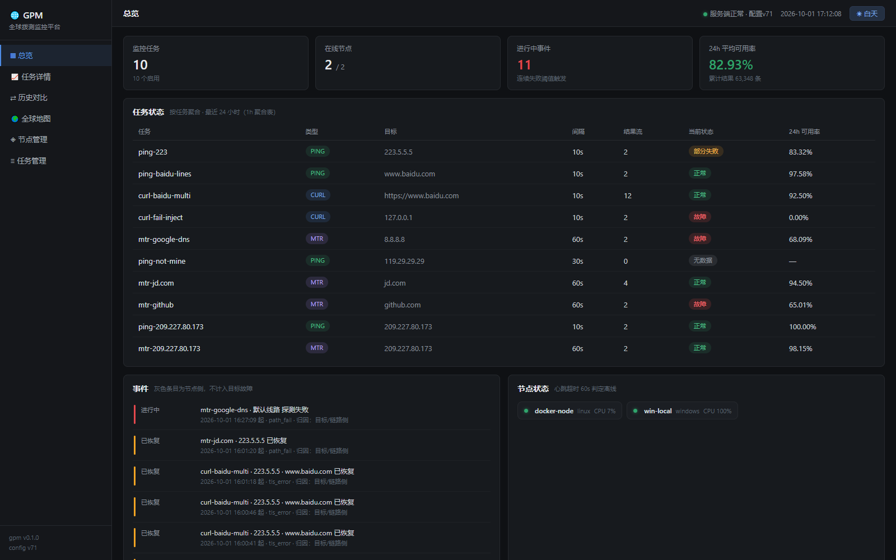
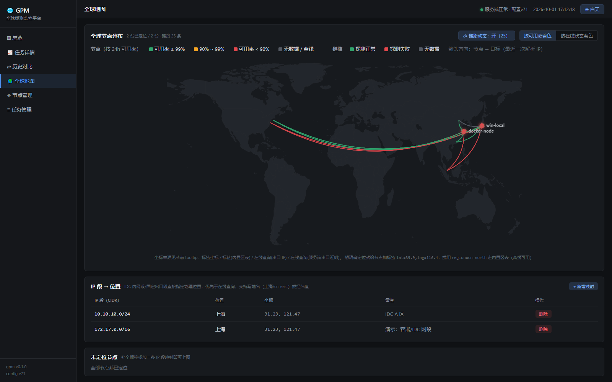
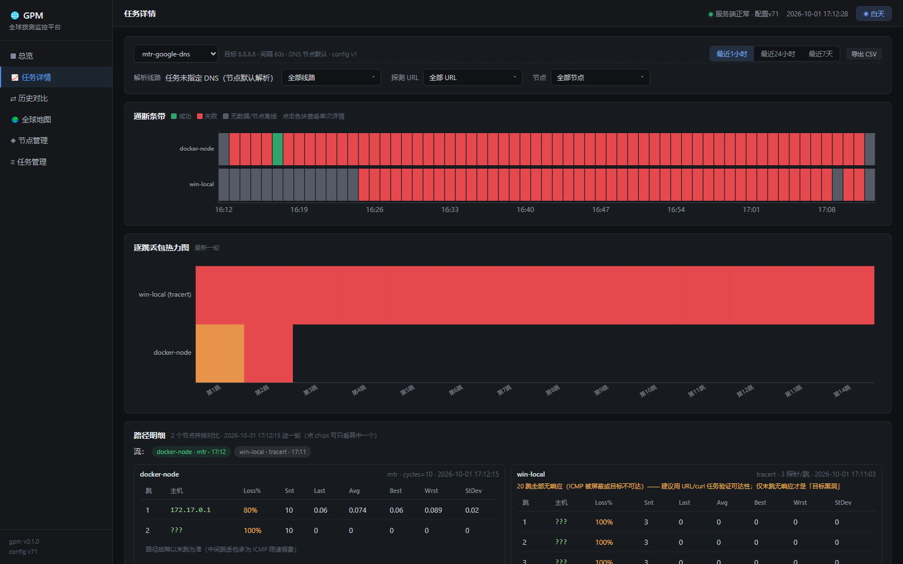
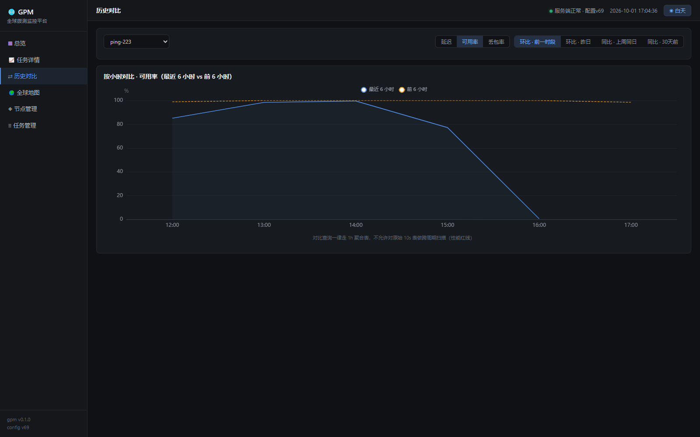
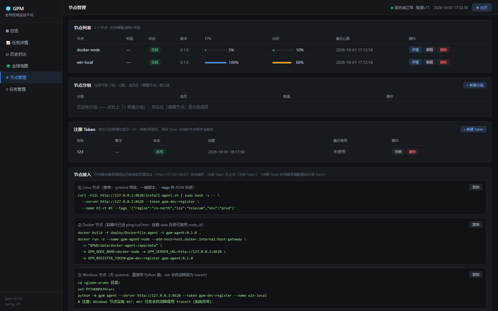
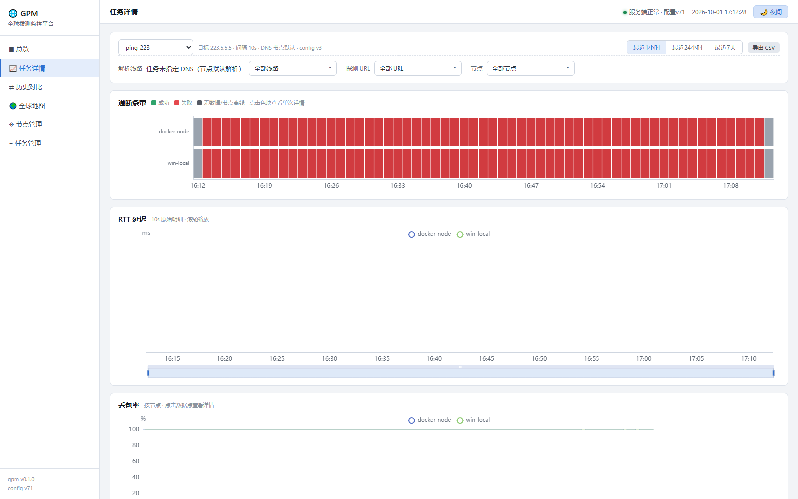

# globe-probe (gpm) · 全球拨测监控平台

> ⚠️ **本项目只做「自己有权监测的目标」的拨测监控，不提供任何攻击、扫描或压测能力**
>
> 所有探测都由你部署的节点**主动出站**发起（pull 模式），服务端不连节点、不开放任何入站端口。

> 实测环境：**Windows 11 节点 + Debian 13 容器节点**（双节点同时在线），单库已实测导入 **6.7 万+ 条探测结果 / 1.5 万+ 聚合桶**

把部署在各地/各机房的拨测节点统一纳管，周期执行 **ping / curl / mtr** 探测并集中汇聚，以最高 **10 秒粒度**的时序图表呈现目标的通断、延迟与质量；支持 **DNS 一等线路**（UDP/TCP/DoH/DoT）、**curl 多 URL**、**路径逐跳多节点并排**、**GeoIP 世界地图与探测链路动画**、**历史同比/环比**，中文 WebUI（白天/夜间主题）。

## 功能特性

- 🛰 **节点纳管**：Token 注册（幂等）、15s 心跳、60s 超时离线判定、版本/标签/资源上报；节点详情含**本机 IP / 出口 IP / OS 版本 / 上线时长**与**最近 24h CPU·内存曲线**
- 🧩 **节点分组**：任务可按「组」分配（`g:<组id>` / `g:<组名>`），与逐节点勾选**可混用**；删组自动从任务分配里摘除并递增 config_version
- 🔑 **注册 Token 管理**：多 Token（明文仅返回一次、库存哈希）、可停用/吊销；**吊销后该 Token 注册的节点同步与上报直接 401**；旧的单 Token 退化为引导 Token
- ⏱ **任务下发**：WebUI / CLI 双通道；pull 模式（NAT 友好），config_version 版本化，节点 15s 内拉取生效
- 🔍 **拨测执行**：ping（RTT/丢包，中英文输出双解析）、curl（状态码/各阶段耗时/期望状态码/多 URL）、mtr（逐跳明细）
- 🪟 **Windows 路径探测**：mtr 无 Windows 版 → 自动降级用系统 **tracert**（每跳 3 探针），输出与 mtr 同构，前端按 mode 标注
- 🌐 **DNS 一等线路**：`223.5.5.5`（auto：UDP→TCP→DoH）、`doh:<URL>`、`dot:<ip>[:853]`、`<ip>@<port>`、`udp:` / `tcp:` 强制线路；纯 Python RFC1035 解析器 + **fake-ip 检测自动升级 DoH**
- 📦 **结果链路**：批量上报、主键去重、迟到窗口、时钟偏差标记、**离线本地缓冲补传**（实测断连后自动补齐）
- 🧮 **幂等聚合**：10s 原始 → 1m → 5m → 1h → 1d 级联重算，保留策略可配
- 🚨 **事件流**：连续失败 ≥3 开启、连续成功 ≥2 恢复（可配）；**节点离线/恢复也进事件流**，以灰色「节点侧」标注且不计入目标故障
- 🌍 **全球地图**：节点标桩按**可用率/在线状态**着色 + **探测链路动画**（节点 → 目标最近一次解析 IP，箭头沿弧流动）+ **自定义「IP 段 → 位置」**（IDC 内网段如 `10.10.10.0/24` 直接定到上海）+ 完整图例
- 📈 **历史对比**：延迟 / 可用率 / 丢包率三指标可选；昨日 / 上周同日 / 30 天前 + **前一时段**（窗口按已有历史自适应，刚上线也能比）；无对比数据时说明原因
- 🖥 **中文 WebUI**：总览 / 任务详情（通断条带 + 10s 曲线 + 单次详情弹窗 + mtr 多节点并排）/ 历史对比 / 全球地图 / 节点管理（接入示例、分组、Token、IP 段映射）/ 任务管理；**白天·夜间主题一键切换**
- 🔔 **告警闭环**：通知渠道（通用 Webhook / 企业微信 / 钉钉（含加签）/ 飞书 / SMTP 邮件，支持「测试发送」）；
  规则支持**可用率 / 延迟均值 / 延迟 P95 / 丢包率 / 节点离线**，可按任务或节点生效；
  含**静默期去重**、**恢复通知**、**维护窗口豁免**，告警历史记录每次送达结果与失败原因
- 📊 **SLA 报表**：按任务/节点的可用率、探测数、失败数、RTT 均值/P95、丢包率，事件时长合计与 **MTTR/MTBF**，
  支持 24 小时 / 7 天 / 30 天窗口与 **CSV 导出**；另可生成「巡检报告」Markdown 摘要（可直接推给通知渠道）
- 📈 **Prometheus 指标**：`/metrics` 暴露 `gpm_*`（节点在线/心跳年龄/CPU/内存、任务可用率/流数、事件数、接入计数），
  便于接入既有监控栈
- 📤 **导出**：JSON / CSV

## 环境要求

- Python **3.11+**（服务端与节点同一套代码）
- Windows 10/11 或 Linux（Debian 12+ / Ubuntu 20.04+ / CentOS 7.9+）
- 系统工具：`ping`（自带）、`curl`（curl 任务）、`mtr`（mtr 任务，Linux；缺失时如实上报 `skipped/tool_missing`）
- 无 Node / 无前端构建：WebUI 是原生 JS + 本地打包的 ECharts

## 界面预览

总览（任务状态、事件流、节点状态）：



全球地图（探测链路动画 + 图例 + 自定义 IP 段定位）：



任务详情 · 路径逐跳多节点并排（mtr / tracert 分别标注）：



历史对比（指标切换 + 前一时段自适应窗口）：



节点管理（节点列表 / 分组 / 注册 Token / 一键接入示例）：



白天主题（一键切换，图表配色同步）：



## 一键启动

### 服务端（本机）

```bash
python -m venv .venv && . .venv/bin/activate      # Windows: .venv\Scripts\activate
pip install .
gpm server                                        # 默认 http://127.0.0.1:8620
```

未安装也可源码直跑：`PYTHONPATH=src python -m gpm server`（Windows：`set PYTHONPATH=src`）。

### 本机节点（Windows / Linux 均可）

```bash
gpm agent --server http://127.0.0.1:8620 --token gpm-dev-register --name win-local
# 源码直跑：PYTHONPATH=src python -m gpm agent --server ... --token ... --name ...
```

### Linux 节点（systemd 常驻，一键脚本）

```bash
curl -fsSL http://<服务端>:8620/install-agent.sh | sudo bash -s -- \
  --server http://<服务端>:8620 --token <注册Token> \
  --name bj-ct-01 --tags '{"region":"cn-north","isp":"telecom"}'
```

脚本会把源码复制到 `/opt/gpm`、建 venv 并安装为 systemd 服务；也支持 **`--no-systemd`**（前台运行，容器/CI 用）、**`--setup-only`**（只准备环境）、**`--no-tools`**（不装 mtr）。

### Windows 节点（计划任务服务化）

```powershell
powershell -NoProfile -ExecutionPolicy Bypass -File deploy\install-agent.ps1 `
  -ServerUrl http://<服务端>:8620 -Token <注册Token> -Name win-01
# 其他模式：-Status / -Start / -Stop / -Uninstall / -DryRun
```

零额外依赖：注册为**计划任务**（开机自启 + SYSTEM/Highest + 崩溃自动重启 + launcher 自拉起循环），不引入 pywin32/NSSM。

### Docker 节点（容器内含 ping / curl / mtr / psutil）

```bash
docker build -f deploy/Dockerfile.agent -t gpm-agent:0.1.0 .
docker run -d --name gpm-agent-node --add-host=host.docker.internal:host-gateway \
  -v "$PWD/data/docker-agent:/app/data" \
  -e GPM_NODE_NAME=docker-node -e GPM_SERVER_URL=http://host.docker.internal:8620 \
  -e GPM_REGISTER_TOKEN=gpm-dev-register gpm-agent:0.1.0
```

挂载 `/app/data` 可复用 `node_id` 与离线缓冲（重建容器不会变成新节点）。

### 默认端口

| 端口 | 用途 |
|---|---|
| **8620** | 服务端 + WebUI（默认只监听 127.0.0.1），也是节点注册/上报入口 |
| **8621** | `scripts/e2e_real.py` 端到端实测用的独立实例（独立端口 + 独立库） |
| **8630** | `scripts/verify_linux_install.sh` 在容器内起的临时服务端 |

服务端配置：`config.yaml`（可选）或环境变量 `GPM_ADMIN_TOKEN` / `GPM_REGISTER_TOKEN`；示例见 `config.example.yaml`。

## 目录结构

### 项目结构

```
.
├── src/gpm/
│   ├── server/          # FastAPI：装配/存储/接入/事件/Web API/Agent API/GeoIP
│   ├── agent/           # 节点：拉配置、jitter 调度、上报、离线缓冲
│   ├── probers/         # 探测器：ping / curl / mtr（含 Windows tracert 降级）
│   │   ├── alerting.py  # 告警规则评估与派发（静默期/恢复/维护窗口）
│   │   ├── notify.py    # 通知渠道发送器（Webhook/企业微信/钉钉/飞书/SMTP）
│   │   ├── metrics.py   # Prometheus 指标渲染
│   │   └── report.py    # SLA 报表与巡检摘要
│   ├── common/          # 协议模型、DNS 解析器（UDP/TCP/DoH/DoT）、工具
│   └── webui/static/    # 中文 WebUI（原生 JS + 本地 ECharts + 精简世界地图）
├── tests/unit/          # 解析器/DNS 线路/Agent 解析路径
├── tests/integration/   # 全链路、节点管理、分组/Token/GeoIP、历史对比
├── scripts/             # e2e_real.py / ui_acceptance.py / benchmark.py / verify_linux_install.sh
├── deploy/              # Dockerfile.agent / install-agent.sh / install-agent.ps1 / uninstall-agent.ps1
├── assets/preview/      # README 界面预览截图
├── docker-compose.yml / Dockerfile
├── .docs/（本地、不入库） # 架构/数据模型/算法/部署/进展记录（ARCHITECTURE / DATA_MODEL / ALGORITHM / DEPLOY / PROGRESS 等）
└── LICENSE / NOTICE.md / README.md
```

### 运行时数据目录（不属于仓库）

| 目录 / 文件 | 作用 |
|---|---|
| `data/gpm.db`（+ `-wal`/`-shm`） | SQLite 主库：节点/任务/结果/聚合/事件/心跳/分组/Token/GeoIP 缓存 |
| `data/agent/` | 本机节点凭据与离线缓冲 |
| `data/docker-agent/` | Docker 节点挂载的数据目录（复用 node_id） |
| `artifacts/ui/` | 浏览器验收截图与 `report.json` |

均已在 `.gitignore` 中排除，**不要**提交到版本库。

## 系统架构

```
┌───────────────────────────────┐
│ 浏览器（中文 WebUI，原生 JS）  │
└───────────────┬───────────────┘
                │ HTTP /api/*
┌───────────────▼───────────────────────────────┐
│ gpm server（FastAPI + SQLite WAL）             │
│  · 接入：注册/心跳/批量上报（去重·迟到·时钟偏差）│
│  · 后台：离线判定 / 聚合级联 / 保留策略          │
│  · 对外：总览·任务·节点·分组·Token·地图·对比    │
└───────────────▲───────────────────────────────┘
                │ 节点出站拉取配置 + 上报（服务端不连节点）
┌───────────────┴───────────────┐
│ gpm agent（标准库 asyncio）    │
│  · jitter 错峰调度 · 本地缓冲   │
└───────────────┬───────────────┘
                │ subprocess 数组参数（禁 shell）
     系统 ping / curl / mtr（Windows: tracert）
```

## 验证步骤

1. **单元 + 集成测试**
   ```bash
   python -m pytest tests/ -q          # 105 passed
   ```
2. **端到端真实数据实测**（独立端口 8621 + 独立库，真实跑 ping/curl/mtr）
   ```bash
   python scripts/e2e_real.py --duration 100    # 13/13 通过
   ```
3. **浏览器验收**（Playwright + Chrome：逐页截图 + 真实交互 + 控制台/4xx 检查）
   ```bash
   python scripts/ui_acceptance.py               # 14 张截图，0 报错
   ```
4. **Linux 部署验证**（容器内跑 install-agent.sh：依赖→源码→venv→启动→注册成功→systemd 单元渲染）
   ```bash
   bash scripts/verify_linux_install.sh
   ```
5. **基准**
   ```bash
   python scripts/benchmark.py 5000
   ```

## API 端点

| 端点 | 方法 | 说明 |
|---|---|---|
| `/api/health` | GET | 服务健康与 config_version |
| `/api/overview` | GET | 总览：任务/节点/事件/24h 可用率/结果总数 |
| `/api/tasks` | GET / POST | 任务列表（含流数、状态、跳过原因）/ 新建 |
| `/api/tasks/{id}` | PUT / DELETE | 部分更新（类型相关目标校验、间隔下限钳制）/ 删除 |
| `/api/nodes` | GET | 节点列表（状态/CPU/内存/流数/本机与出口 IP） |
| `/api/nodes/metrics` | GET | 节点资源时序（心跳表聚合，供 CPU/内存曲线） |
| `/api/nodes/{id}` | GET / PUT / DELETE | 详情（OS/上线时间/分配任务/24h 可用率/近期事件）/ 改名+标签 / 级联删除 |
| `/api/groups` | GET / POST | 节点分组列表 / 新建 |
| `/api/groups/{id}` | PUT / DELETE | 改名备注 / 删组（自动从任务分配摘除） |
| `/api/groups/{id}/members` | PUT | 覆盖式设置成员 |
| `/api/tokens` | GET / POST | 注册 Token 列表 / 新建（明文仅返回一次） |
| `/api/tokens/{id}` | PUT / DELETE | 启用·吊销 / 删除 |
| `/api/geo/nodes` | GET | 节点定位（含来源：标签 / 区表 / 自定义网段 / 在线查询 / 服务端出口近似） |
| `/api/geo/networks` | GET / POST | 自定义「IP 段 → 位置」列表 / 新增 |
| `/api/geo/networks/{id}` | DELETE | 删除映射 |
| `/api/geo/places` | GET | 内置区表（地名 → 坐标，供前端下拉） |
| `/api/geo/flows` | GET | 探测链路（节点 → 目标解析 IP，供地图动画） |
| `/api/query/uptime` | GET | 通断条带（按节点/线路/URL 单元格） |
| `/api/query/series` | GET | 时序（raw / 1m / 5m / 1h，指标 rtt·loss·avail·p95…） |
| `/api/query/streams` | GET | 结果流列表（节点×线路×URL，含最近状态与解析 IP） |
| `/api/query/curl_codes` | GET | HTTP 状态码分布 |
| `/api/query/mtr` | GET | 路径明细（每流最近一条 / 指定轮次），含并排对比所需数据 |
| `/api/query/incidents` | GET | 探测事件（通断状态机） |
| `/api/query/incidents_all` | GET | 全量事件（含节点离线/恢复，带 kind/node_name） |
| `/api/compare` | GET | 历史对比（mode=yesterday·lastweek·lastmonth·prev，metric=rtt·avail·loss） |
| `/api/detail` | GET | 单次探测详情（条带色块点击） |
| `/api/export` | GET | 导出 JSON / CSV |
| `/api/alerts/channels` | GET / POST | 通知渠道列表 / 新建（webhook·企业微信·钉钉·飞书·SMTP） |
| `/api/alerts/channels/{id}` | PUT / DELETE | 编辑·启停 / 删除 |
| `/api/alerts/channels/{id}/test` | POST | 测试发送（返回成功与否与原因） |
| `/api/alerts/rules` | GET / POST | 告警规则列表 / 新建 |
| `/api/alerts/rules/{id}` | PUT / DELETE | 编辑·启停 / 删除 |
| `/api/alerts/windows` | GET / POST | 维护窗口列表 / 新建 |
| `/api/alerts/windows/{id}` | DELETE | 删除维护窗口 |
| `/api/alerts` | GET | 告警历史（含送达结果与失败原因） |
| `/api/alerts/evaluate` | POST | 立即评估一轮规则 |
| `/api/report/sla` | GET | SLA 报表（窗口/任务/节点/事件/MTTR/MTBF） |
| `/api/report/daily` | GET | 逐日可用率序列 |
| `/api/report/digest` | GET | 巡检报告（Markdown 标题+正文，可推送给通知渠道） |
| `/metrics` | GET | Prometheus 文本格式指标（`gpm_*`） |
| `/api/agent/register` | POST | 节点注册（幂等；多 Token 校验） |
| `/api/agent/sync` | POST | 心跳 + 配置下发（含组级任务过滤；Token 吊销即拒） |
| `/api/agent/results` | POST | 批量结果上报（去重 / 迟到 / 时钟偏差） |

写接口可选开启 `admin_token`（配置后需带 `X-Admin-Token`）。

## 节点标签与定位

标签（tags）是自由键值对，用于归类与地图定位：

| 常用键 | 含义 | 示例 |
|---|---|---|
| `region` / `city` / `country` | 地域（走内置区表解析坐标） | `region=cn-north`、`city=上海` |
| `lat` / `lng` | 精确坐标（优先生效） | `lat=31.23,lng=121.47` |
| `isp` | 运营商 | `telecom` / `unicom` / `mobile` |
| `env` / `provider` / `line` | 环境 / 云厂商 / 线路类型 | `prod` / `aliyun` / `bgp` |

定位优先级：**标签坐标 → 标签地名 → 自定义 IP 段（本机 IP 优先，其次出口 IP）→ 在线查询（节点出口 IP）→ 在线查询（服务端出口近似，标记 approx）**。
IDC 内网段（如 `10.10.10.0/24` 在上海）直接在全球地图页「IP 段 → 位置」里登记即可，按最长前缀匹配。

注册时带标签（Linux 一键脚本）：`--tags '{"region":"cn-north","isp":"telecom"}'`；事后可在「节点管理 → 编辑」里改。

## 安全

- **数据全部本地**：SQLite 单文件，无云依赖；除「在线 GeoIP 查询」（结果缓存 24h，可不用）外无外部请求
- **注册 Token**：可多枚、可吊销；吊销后该 Token 注册的节点立即被拒；写接口可加 `admin_token` 二次保护
- **不主动连节点**：节点出站 pull，天然适配 NAT / 内网 / 动态 IP
- **输入白名单**：任务目标、URL、DNS 线路均校验，拒绝 shell 元字符；子进程一律数组参数、**禁 shell**
- **静态资源本地托管**：无 CDN、无外链

## 性能与保留策略

| 项 | 值 |
|---|---|
| 原始结果（10s）保留 | 30 天 |
| 1m / 5m / 1h 聚合保留 | 90 / 180 / 730 天 |
| 节点心跳保留 | 7 天 |
| 单次上报批量上限 | 500 条（超出截断并回执 `truncated`） |
| 查询红线 | 对比与长窗查询只走聚合表，不允许跨周期扫原始表 |
| 实测规模 | 10 个任务 / 双节点共 24 条结果流 / 单库 6.7 万+ 结果（约 13 小时） |

## 约束与已知限制

- **SQLite 单文件（WAL）**：单机万级结果流可跑；再大需换 PostgreSQL / TimescaleDB（存储层已隔离）
- **mtr 仅 Linux**：Windows 节点自动降级 `tracert`（每跳仅 3 探针，丢包率粒度比 mtr 粗）
- **代理 TUN / 企业 NAT 环境**：UDP53 可能被劫持返回 fake-ip —— 解析器会自动升级 DoH；主机名 + ICMP 场景建议给任务指定 DNS 线路
- **历史对比需要历史**：不足 24h 时「昨日同期」无数据，页面会用自适应窗口的「前一时段」替代并说明原因
- **未做**：告警通知（Webhook/邮件/钉钉）、多租户、GeoIP 离线库（当前用在线查询 + 自定义网段）
- **Linux 实机 systemd**：仅在容器内用 shim 验证过单元渲染，上生产前请在目标发行版抽样确认（部署细节见本地 `.docs/DEPLOY.md`，不入库）

## 许可证

本项目基于 [Apache License 2.0](LICENSE) 开源；第三方组件与参考项目见 [NOTICE.md](NOTICE.md)。

## 社区

本项目在 [LINUX DO](https://linux.do) 社区进行开源推广，感谢社区佬友的交流、反馈与建议。

## 致谢 / 第三方组件

- [FastAPI](https://github.com/fastapi/fastapi)、[Uvicorn](https://github.com/encode/uvicorn)、[Pydantic](https://github.com/pydantic/pydantic) 及所有开源依赖的作者
- [Apache ECharts](https://github.com/apache/echarts)：WebUI 图表库（本地分发，未修改）
- 世界地图数据：Natural Earth / ECharts world.json（抽稀后随包分发）
- 运行时调用的系统工具：`ping` / `curl` / `mtr`
